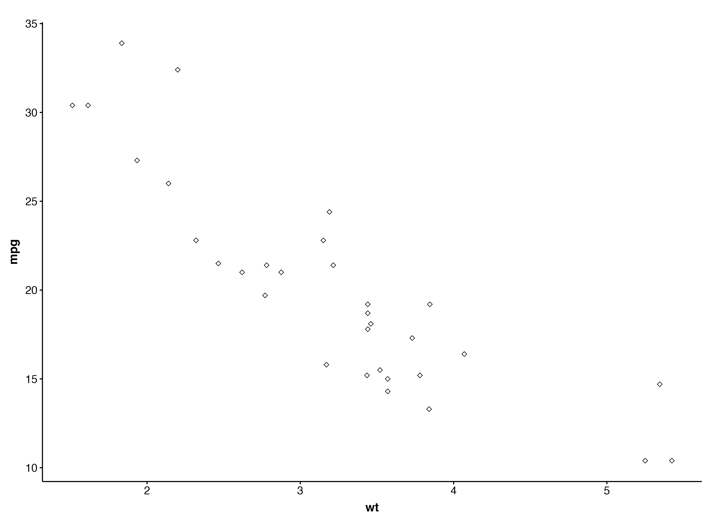

# GBMUtils

R-package containing helper functions used in the GBM project. 

The package can be easily installed through GitHub: 

```r
devtools::install_github("GaitiLab/GBMutils")
# or
remotes::install_github("GaitiLab/GBMutils")
# or
pak::pkg_install("GaitiLab/GBMutils")
# or
pacman::p_load_gh("GaitiLab/GBMutils")
```

The following sections will explain how this package can be used.

##  Script setup 

`set_wd()` - sets up working directory based on the directory of the script that you're running.

`setup_default_argparser()` - sets up the `ArgumentParser()` with two default arguments: 
1. `description`, used as follows `argparse::ArgumentParser(description = description)`
1. `default_output`, name of output folder, by default `output`. 

Use case:

```r
parser <- setup_default_argparser(

    description = "Get metadata",

)
parser$add_argument("--input_file", help = "Seurat input file", type = "character")
args <- parser$parse_args()

```

The `parser` object contains by default 2 arguments `--log_level` (for the logger; by default=5) and `--output_dir` .

`init_logging()` - set up logging, with two arguments, `log_level` (required, value between 1-5) and log_file` (optional) which should be a location to a path in case you want to actually save the log messages to a file. 

Use case: 

```r

logr <- init_logging(log_level = 5)

```

After initialization, you can use the different types of log messages: 

```
log_debug("This is a message")
log_info("This is a message")
log_error("This is a message")
log_warn("This is a message")
```

## Loading GBM specific data 

`load_GBM_data()` - Load GBM Seurat object.

`load_invasive_signature()` - Load invasive gene signature. 

`load_color_palette(name = "CellClass_L2")` - Load color palette. Name can be one of: Region, CellClass_L2, CCI_CellClass_L2, GBMap or ATAC. Will return a named vector with the colors. 

## Visualization 

`GBM_theme()` - `ggplot2` theme, standard theme for GBM project. In the use case below `+ theme()` is optional, you can use it to **override** certain settings described in GBM_theme()

```r
# + theme() is optional
ggplot() + geom_point() + GBM_theme() + theme()

```

```r
# Setup of GBM_theme() for reference
GBM_theme <- function(base_size = 14, base_family = "Helvetica") {
    (theme_foundation(base_size = base_size, base_family = base_family)
    + theme(
            plot.title = element_text(
                face = "bold",
                size = rel(1.2), hjust = 0.5
            ),
            text = element_text(),
            panel.background = element_rect(colour = NA),
            plot.background = element_rect(colour = NA),
            panel.border = element_rect(colour = NA),
            axis.title = element_text(face = "bold", size = rel(1.1)),
            axis.title.y = element_text(angle = 90, vjust = 2),
            axis.title.x = element_text(vjust = -0.2),
            axis.text = element_text(size = rel(1)),
            axis.line = element_line(colour = "black"),
            axis.ticks = element_line(),
            # panel.grid.major = element_line(colour = "#f0f0f0"),
            panel.grid.major = element_blank(),
            panel.grid.minor = element_blank(),
            legend.key = element_rect(colour = NA),
            legend.position = "bottom",
            legend.direction = "horizontal",
            legend.key.size = unit(0.2, "cm"),
            legend.spacing = unit(0, "cm"),
            legend.title = element_text(face = "plain"),
            plot.margin = unit(c(10, 5, 5, 5), "mm"),
            strip.background = element_rect(colour = "#ffffff", fill = "#ffffff"),
            strip.text = element_text(face = "bold", size = rel(1.1))
        ))
}

```



Example of `GBM_theme()`

## General helper functions

`create_dir(dir_path)` - creates directory if not existing, with `dir_path` the directory to create. 
